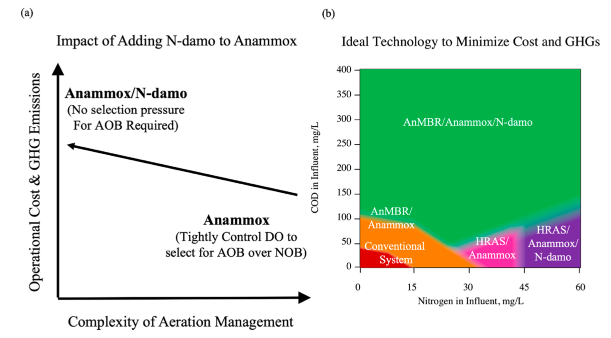

# ndamo-econ
This model compares a traditional nitrification/denitrification wastewater treatment system to four theoretically possible nitrogen removal schemes. The operational cost and environmental impact are compared. 

# Publication
Environ. Sci. Technol. 2019, 53, 21, 12935–12944
Publication Date:October 8, 2019
https://doi.org/10.1021/acs.est.9b04764

# Model Description
The model is thoroughly described in the publication's [supplementary material](SupplementalInformation.pdf)

# Graphical Conclusion

More detail about these conlcusions can be found within the [publication](Cogert 2019.pdf)
